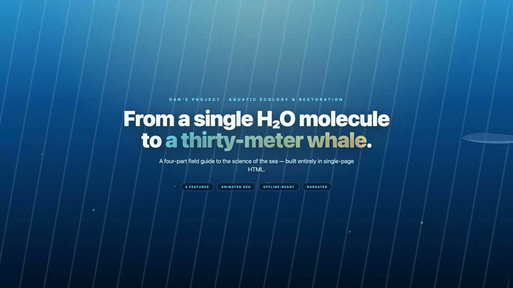
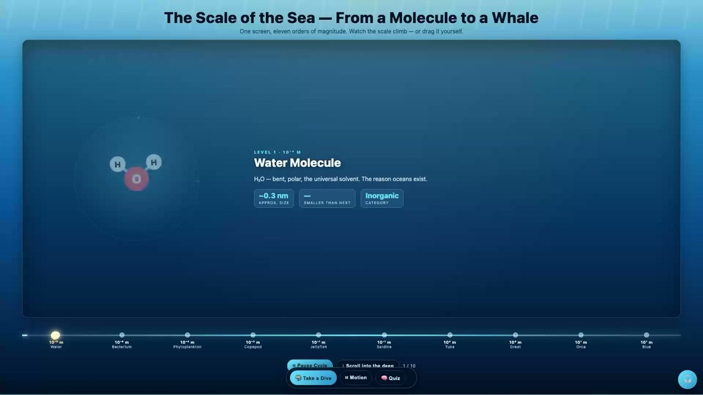
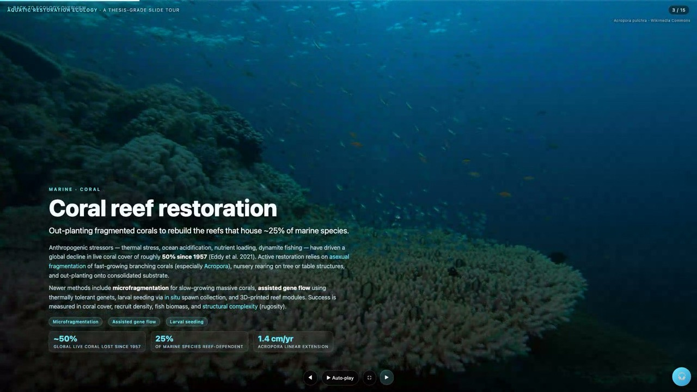
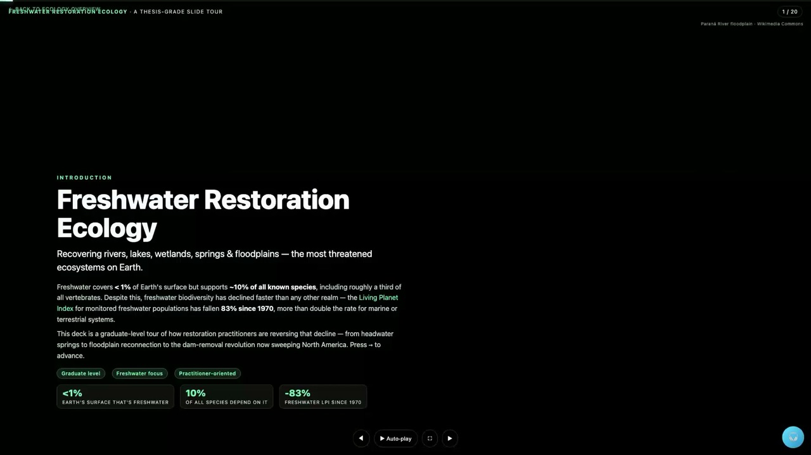
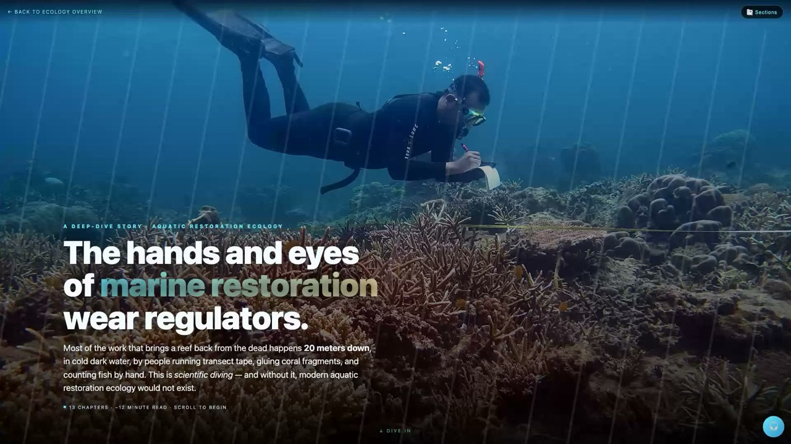
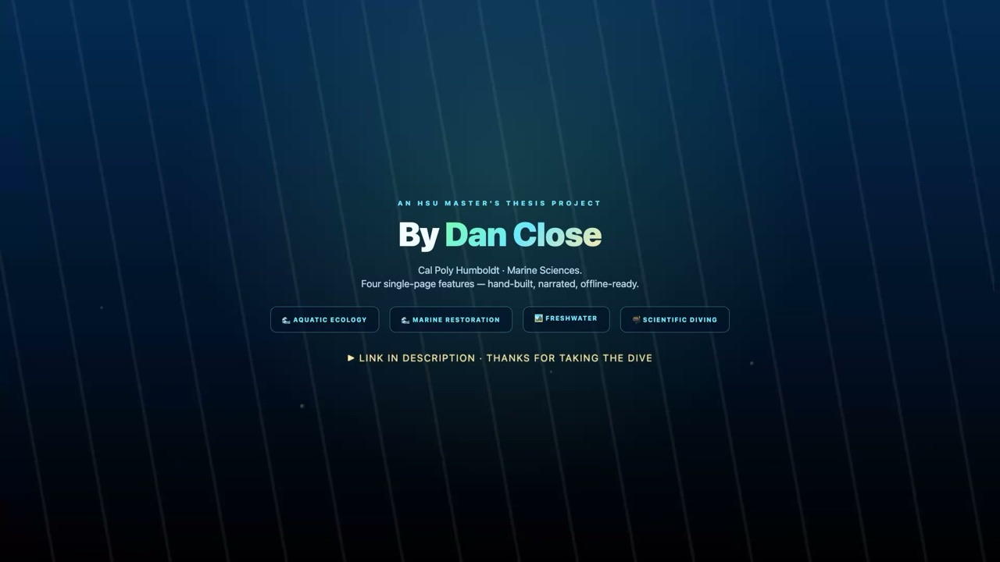

<div align="center">



# 🌊 Dan Close · Aquatic Ecology &amp; Restoration

### *From a single H₂O molecule to a thirty-meter blue whale.*

**An [HSU](https://www.humboldt.edu) Master's Thesis Project at [Cal Poly Humboldt · Marine Sciences](https://catalog.humboldt.edu/preview_program.php?catoid=11&poid=4156)**

[](https://www.humboldt.edu)
[](https://www.humboldt.edu)
[](https://claude.com/claude-code)
[](LICENSE)

[](https://github.com/nicedreamzapp/dan-aquatic-ecology/stargazers)
[](https://github.com/nicedreamzapp/dan-aquatic-ecology/commits/main)
[](https://github.com/nicedreamzapp/dan-aquatic-ecology)

### **[🌐 Open the live site](https://nicedreamzapp.github.io/dan-aquatic-ecology/)** · **[▶ Watch the 1-min video](https://youtu.be/clXORLW3_1I)** · **[📰 Project page](https://nicedreamzwholesale.com/software/dan-aquatic-ecology/)**

</div>

---

<div align="center">

### 🎥 1-minute walkthrough

<a href="https://youtu.be/clXORLW3_1I">
  
</a>

*Narrated by Microsoft's Ava neural voice · assembled by Claude Code · [Watch on YouTube](https://youtu.be/clXORLW3_1I)*

</div>

---

## 📚 What's in it

Four single-file HTML features. **No build step. No npm. No tracking. No API keys.** Email or AirDrop any file and it just works.

<table>
<tr>
<td width="50%">

<h3>🌊 Aquatic Ecology</h3>
<sup><b>From Molecules to Whales</b></sup>
<p>Eleven orders of magnitude on one screen. Auto-cycling Scale-of-the-Sea hero (water molecule → bacterium → phytoplankton → copepod → jellyfish → sardine → tuna → great white → orca → 30-meter blue whale) plus a vertical depth tour with click-to-learn modals on every layer and an end-of-page quiz.</p>
<a href="https://nicedreamzapp.github.io/dan-aquatic-ecology/dan-aquatic-ecology.html"><b>Open feature →</b></a>
</td>
<td width="50%">

<h3>🌊 Marine Restoration</h3>
<sup><b>Thesis-quality slide tour</b></sup>
<p>Coral fragmentation &amp; microfragmentation (5–25× growth boost), mangrove EMR, oyster reef recovery, seagrass blue-carbon meadows, kelp forests via sea-otter return, salt-marsh living shorelines, and the 30×30 MPA target. Auto-play, fullscreen, arrow-key driven.</p>
<a href="https://nicedreamzapp.github.io/dan-aquatic-ecology/dan-restoration-ecology.html"><b>Open feature →</b></a>
</td>
</tr>
<tr>
<td width="50%">

<h3>🏞 Freshwater Restoration</h3>
<sup><b>The most threatened ecosystems on Earth</b></sup>
<p>Beavers as ecosystem engineers, Beaver Dam Analogs (BDAs), dam removal (2,000+ US dams since 1912 and accelerating), stream channel restoration, riparian zones, floodplain reconnection, eutrophication recovery, urban green infrastructure, constructed treatment wetlands.</p>
<a href="https://nicedreamzapp.github.io/dan-aquatic-ecology/dan-freshwater-restoration.html"><b>Open feature →</b></a>
</td>
<td width="50%">

<h3>🤿 Scientific Diving</h3>
<sup><b>The hands &amp; eyes of marine restoration</b></sup>
<p>A 13-chapter long-form narrative on AAUS-credentialed divers — transects, point-intercept sampling, photo-quadrats, microfragmentation hand-work, photogrammetry rigs, lionfish pole spears, and the rigor (DSO oversight, 100 hours of training, paired buddy diving).</p>
<a href="https://nicedreamzapp.github.io/dan-aquatic-ecology/dan-scientific-diving.html"><b>Open feature →</b></a>
</td>
</tr>
</table>

---

## 🔬 The science

<table>
<tr><th>Layer</th><th>Why it matters</th></tr>
<tr><td><b>Phytoplankton</b></td><td>Drifting algae produce roughly <b>half of Earth's oxygen</b>. Every other breath comes from the ocean.</td></tr>
<tr><td><b>Copepods</b></td><td>Likely the <b>most abundant animal on Earth</b>. The great middle link of the marine food web.</td></tr>
<tr><td><b>Apex predators</b></td><td>Stabilize entire systems via trophic cascade. Remove sea otters → urchins explode → kelp forests collapse.</td></tr>
<tr><td><b>Microfragmentation</b></td><td>Cutting massive corals into 1cm chunks triggers a <b>5–25× growth boost</b>. Plant 200 today, build a coral head ten years ahead.</td></tr>
<tr><td><b>Whale pump</b></td><td>Whales feed deep, defecate at the surface — fertilizing phytoplankton with iron + nitrogen. Bring the whales back, the carbon engine speeds up.</td></tr>
<tr><td><b>Oyster reefs</b></td><td>One adult oyster filters up to <b>50 gallons/day</b>. Chesapeake populations sit at <b>under 1%</b> of pre-colonial biomass.</td></tr>
<tr><td><b>Beavers</b></td><td>Free landscape-scale restoration. <a href="https://en.wikipedia.org/wiki/Beaver_dam_analog">BDAs</a> are wood-and-post structures that <em>invite the real thing</em>.</td></tr>
<tr><td><b>Scientific diving</b></td><td>Without AAUS-credentialed divers, modern aquatic restoration ecology would not exist.</td></tr>
</table>

---

## 🤖 How it was built — with Claude Code

<table>
<tr>
<td width="60%">

Built end-to-end in **[Claude Code](https://claude.com/claude-code)** — Anthropic's AI pair-programming CLI on **Opus 4.7**. ~6,000 lines of HTML / CSS / JavaScript across five self-contained pages, all in one sitting.

- **No build step.** Pure HTML, inline SVG, inline JavaScript — every page is a single file.
- **Hand-coded animations.** Every organism, every diver, every tool — molecules, microbes, copepods, photogrammetry rigs — drawn in code.
- **Self-narrating.** Each page has a 🎧 button. A tiny local Flask service wraps `edge-tts` to call Microsoft's free Edge neural-voice backend (Ava) and serves cached MP3s on demand.
- **The 1-minute YouTube video** was assembled by Claude too — Playwright headless Chromium recording at 1920×1080, ffmpeg concat / fade / audio mixing, all scripted.

</td>
<td width="40%" align="center">

</td>
</tr>
</table>

---

## ⚡ Try it locally

```bash
git clone https://github.com/nicedreamzapp/dan-aquatic-ecology
cd dan-aquatic-ecology
open index.html
```

That's it. Every page works as a standalone HTML file — double-click any of them.

### Optional: run the narration server

For studio-quality Microsoft neural narration on the 🎧 button:

```bash
python3 -m venv venv && source venv/bin/activate
pip install edge-tts flask flask-cors
python server.py     # listens on 127.0.0.1:9200
```

Then any feature page's 🎧 button plays in Ava's full neural voice. Falls back to the browser's native Web Speech API when the service isn't running.

---

## 📊 By the numbers

<table>
<tr>
<td align="center"><h3>11</h3>orders of magnitude<br/><sub>molecule → whale</sub></td>
<td align="center"><h3>30</h3>chapters of science<br/><sub>across 4 features</sub></td>
<td align="center"><h3>~6k</h3>lines of code<br/><sub>HTML / SVG / JS</sub></td>
<td align="center"><h3>0</h3>npm dependencies<br/><sub>zero build step</sub></td>
<td align="center"><h3>5</h3>HTML files<br/><sub>each works offline</sub></td>
</tr>
</table>

---

## 🗺️ Project map

```
dan-aquatic-ecology/
├── index.html                          ← landing hub with 4 animated cards
├── dan-aquatic-ecology.html            ← molecule-to-whale scale + depth tour
├── dan-restoration-ecology.html        ← marine restoration slide deck
├── dan-freshwater-restoration.html     ← freshwater restoration slide deck
├── dan-scientific-diving.html          ← 13-chapter narrative
├── voice-tester.html                   ← compare 5 Microsoft neural voices side-by-side
├── _video-intro.html                   ← title card (used to record the YouTube video)
├── _video-outro.html                   ← outro card (used to record the YouTube video)
├── dans-aquatic-ecology-1080p.mp4      ← the 1-minute walkthrough, 1080p H.264
├── screenshots/                        ← still frames used in this README
├── CLAUDE.md                           ← context for future Claude Code sessions
├── README.md                           ← you are here
└── LICENSE                             ← MIT
```

---

## 💛 Credits

**Author** · Dan Close — HSU Master's Thesis Project, Cal Poly Humboldt Marine Sciences

**Built with** · [Claude Code](https://claude.com/claude-code) (Anthropic, Opus 4.7) — pair-programmed in one sitting

**Photos** · [Wikimedia Commons](https://commons.wikimedia.org/) (public domain / CC). Diver illustrations are inline SVG.

**Voices** · Microsoft neural voices via [`edge-tts`](https://github.com/rany2/edge-tts) — free, no API key

**Hosting** · Source on GitHub · Live site on [GitHub Pages](https://nicedreamzapp.github.io/dan-aquatic-ecology/) · Featured on [Nice Dreamz Software](https://nicedreamzwholesale.com/software/dan-aquatic-ecology/)

---

<div align="center">

### **MIT licensed.** Use, remix, share — credit Dan Close where you can.

[](https://nicedreamzapp.github.io/dan-aquatic-ecology/)
[](https://youtu.be/clXORLW3_1I)
[](https://nicedreamzwholesale.com/software/dan-aquatic-ecology/)

<sub>🌊 Made for Dan, with the deepest oceans in mind.</sub>

</div>
